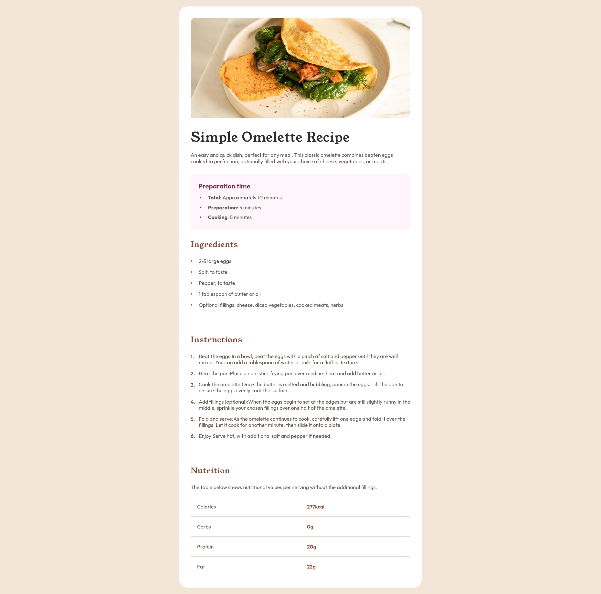
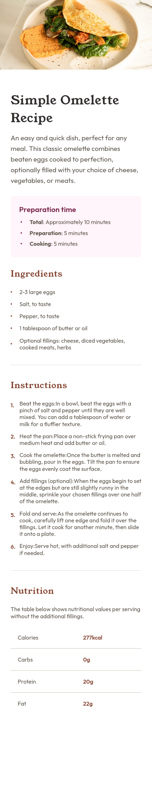

# Frontend Mentor - Recipe page solution

This is a solution to the [Recipe page challenge on Frontend Mentor](https://www.frontendmentor.io/challenges/recipe-page-KiTsR8QQKm). Frontend Mentor challenges help you improve your coding skills by building realistic projects.

## Table of contents

- [Overview](#overview)
  - [The challenge](#the-challenge)
  - [Screenshot](#screenshot)
  - [Links](#links)
- [My process](#my-process)
  - [Built with](#built-with)
  - [What I learned](#what-i-learned)
  - [Continued development](#continued-development)
- [Author](#author)
- [Acknowledgments](#acknowledgments)

## Overview

### The Challenge

The challenge was to create a simple responsive recipe page from Frontend Mentor.

### Screenshot

    - Desktop View



    - Mobile View



### Links

- Solution URL: Click [Here](https://github.com/sreehariv-code/recipe-main)
- Live Site URL: Click [Here](https://sreehariv-code.github.io/recipe-main/)

## My process

### Built with

- Semantic HTML5 markup
- CSS custom properties
- Flexbox
- Desktop-first workflow

### What I learned

I have implemented the use case of :not psuedo class in my code for created the border for table layout.

```css
.nutrition .table .row:not(:last-child) {
  border-bottom: 2px solid var(--light-gray);
}
```

I have also made a custom ordered list using 'counter-increment' properties in the ::before psuedo-element

```css
ol li::before {
  counter-increment: list-item;
  content: counter(list-item) ".";
  position: absolute;
  left: 0;
  font-size: 1em;
  color: var(--nutmeg);
  line-height: 1;
  font-weight: var(--font-600);
  top: 8%;
}
```

### Continued development

I am looking forward for a feedback from other developers regarding the improvement in accessibility of the web page. This feedback will be available in the next major release of the documentation

## Author

- Githhub - [@sreehariv-code](https://github.com/sreehariv-code)
- Frontend Mentor - [@sreehariv-code](https://www.frontendmentor.io/profile/sreehariv-code)
- Twitter - [@sreehariv07](https://x.com/sreehariv07)
